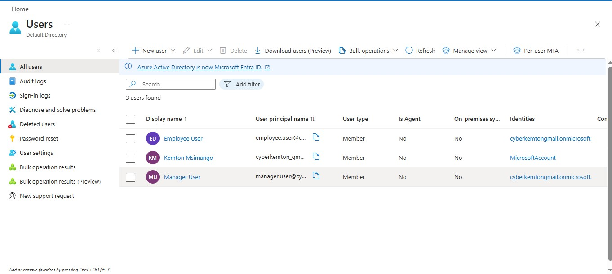
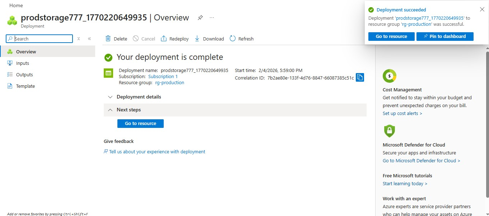
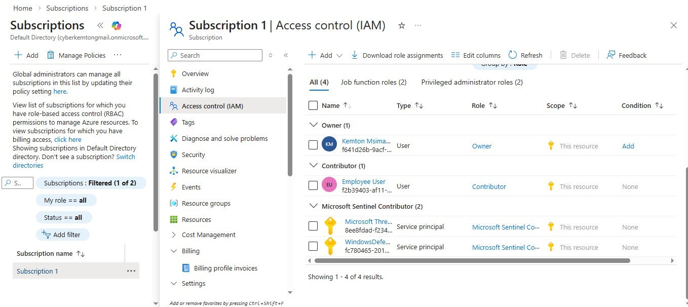
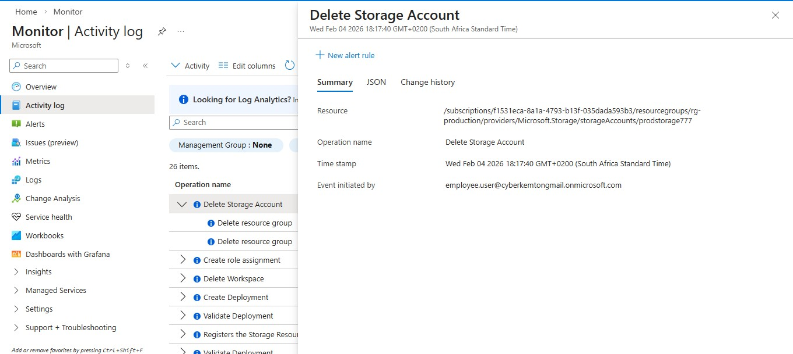
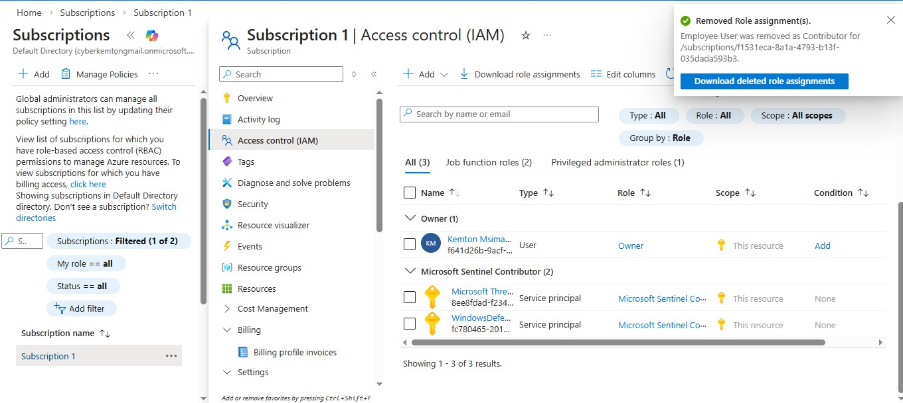
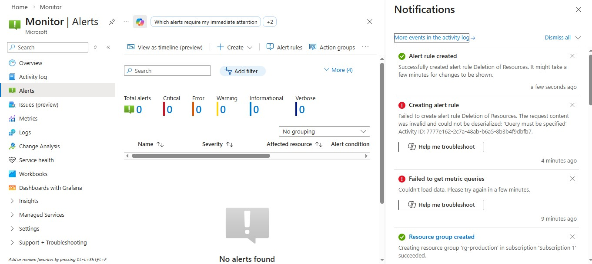

# Azure RBAC Misconfiguration Simulation

How excessive permissions led to a production resource deletion

Why I built this project

I wanted to move beyond theory and apply AZ-104 concepts in a practical way. Many real cloud incidents are not caused by hackers or malware. They happen because someone was given more access than they should have.

This project simulates a realistic RBAC misconfiguration where an employee is over-permissioned and uses that access to delete a production resource. No exploit. No malware. Just access doing exactly what it was allowed to do.

  

Environment

✅  Microsoft Entra ID

✅  Azure RBAC

✅  Azure Storage

✅  Azure Activity Log

✅  Azure Monitor (alerts)

# Step 1: I Created The Identities
Why this matters ✅

I wanted this environment to reflect real users, not test accounts. One user represents a legitimate admin and the other represents an employee who will later be over-permissioned.

What I did

Created two users in Microsoft Entra ID:

manager.user@yourtenant.onmicrosoft.com

employee.user@yourtenant.onmicrosoft.com

Assigned no roles at this stage to maintain a clean baseline

📸 Screenshot 1 – Entra ID users created (ManagerUser and EmployeeUser)

  

# Step 2: I Created a Production Resource
Why this matters ✅

To demonstrate impact, there needs to be a real resource that should not be deleted.

What I did

Created a resource group named rg-production

Created a storage account named prodstorage001 inside the resource group

Kept default settings to focus strictly on access control

📸 Screenshot 2 – Production resource group and storage account created

  

# Step 3: I Introduced an RBAC Misconfiguration
Why this matters ✅

This reflects a common real-world mistake where access is granted too broadly at the wrong scope.

What I did

Assigned the Contributor role to employee.user

Scope: Subscription

This role assignment allowed the employee to delete most resources across the environment.

📸 Screenshotscreenshot 3 – Employee assigned Contributor role at subscription scope (misconfiguration)

  

# Step 4: I Simulated the Insider Incident
Why this matters ✅

To prove this was not theoretical, I performed the action using the over-permissioned account.

What I did

Signed in as employee.user using a private browser session

Navigated to the production resource group

Deleted the storage account or entire resource group

The deletion succeeded because the permissions allowed it.

📸 Screenshot 4 – Employee successfully deletes production resource

  

  

# Step 5: I Investigated the Incident
Why this matters ✅

Security is not just about prevention. It is about visibility and accountability.

What I did

Switched back to the admin account

Opened Azure Monitor → Activity Log

Filtered for delete operations

Reviewed the event details

The logs clearly showed the caller, time, and affected resource.

📸 Screenshot 5 – Activity Log showing deletion performed by EmployeeUser

  

# Step 6: I Fixed the Root Cause
Why this matters ✅

Detection without remediation leaves the risk in place.

What I did

Removed the Contributor role from employee.user at the subscription level

Assigned a least-privilege role scoped only to the required storage resource

This limited access to what was actually needed.

📸 Screenshot 6 – Contributor role removed and least-privilege access applied

  

# Step 7: I Added Monitoring and Alerting
Why this matters ✅

As a security engineer, I aim to reduce response time and improve visibility.

What I did

Created an Azure Monitor alert rule

Trigger condition: delete operations on key resources

Alert notifies immediately when destructive actions occur

This ensures similar incidents are detected early and investigated quickly.

📸 Screenshot 7 – Alert rule for resource deletion events

  

Key takeaways

✅ RBAC misconfigurations can cause real damage

✅ Excessive permissions are often more dangerous than exploits

✅ Azure logs provide strong accountability

✅ Least privilege reduces blast radius

✅ Monitoring closes the detection gap

# Why This Project Matters

This project demonstrates how real cloud security incidents occur, how they can be investigated, and how environments can be improved to prevent recurrence.

It reflects how I approach cloud security: identify risk, validate impact, detect evidence, and strengthen controls.

Thank you for the Read !!
